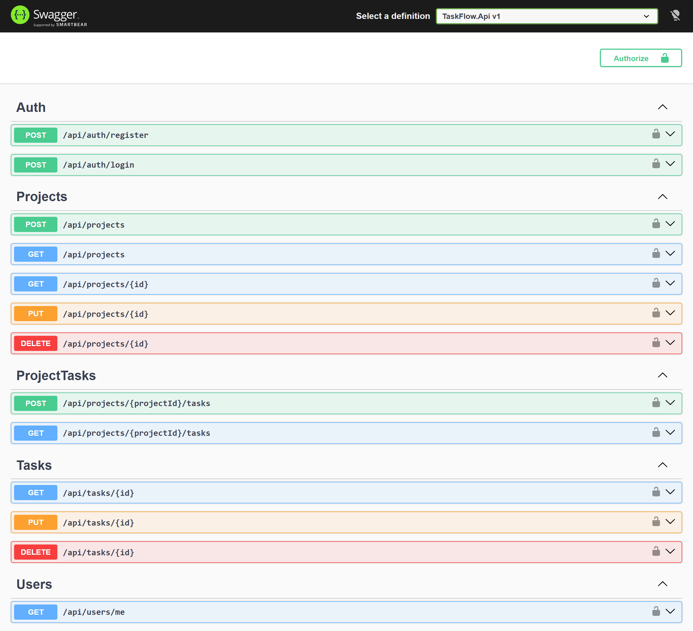

# TaskFlow API


A production-oriented task management REST API built with **ASP.NET Core, C#, Entity Framework Core, SQL Server, JWT authentication, Docker, and GitHub Actions**.

TaskFlow demonstrates backend engineering practices such as layered architecture, authentication, resource ownership, validation, centralized exception handling, automated tests, containerized deployment, and CI automation.

## API Overview



## Features

* JWT-based user registration and authentication
* Secure BCrypt password hashing
* User-specific project management
* Task creation, update, deletion, and retrieval
* Project and task ownership enforcement
* Task filtering by status and priority
* Task search
* Pagination
* FluentValidation request validation
* Centralized exception handling
* ProblemDetails API error responses
* Entity Framework Core with SQL Server
* Database migrations
* Automated tests with xUnit
* Docker and Docker Compose support
* Persistent SQL Server container storage
* GitHub Actions CI
* Automated Docker image build validation

## Technology Stack

### Backend

* .NET 8
* ASP.NET Core Web API
* C#
* Entity Framework Core
* SQL Server
* FluentValidation
* BCrypt
* JWT Bearer Authentication

### Testing

* xUnit
* Moq
* FluentAssertions
* EF Core InMemory
* Coverlet

### DevOps

* Docker
* Docker Compose
* GitHub Actions

## Architecture

TaskFlow uses a layered architecture to separate domain logic, application concerns, infrastructure, and HTTP/API responsibilities.

```text
                    Client
                      |
                      v
              TaskFlow.Api
          Controllers / HTTP
                      |
                      v
          TaskFlow.Application
        DTOs / Interfaces / Rules
                      |
                      v
             TaskFlow.Domain
           Entities / Enums
                      ^
                      |
          TaskFlow.Infrastructure
       EF Core / SQL / Auth Services
                      |
                      v
                 SQL Server
```

The solution is organized into the following projects:

```text
TaskFlow
|
+-- src
|   +-- TaskFlow.Api
|   +-- TaskFlow.Application
|   +-- TaskFlow.Domain
|   +-- TaskFlow.Infrastructure
|
+-- tests
|   +-- TaskFlow.Tests
|
+-- Dockerfile
+-- docker-compose.yml
+-- TaskFlow.sln
```

## Authentication Flow

```text
Register / Login
       |
       v
Validate credentials
       |
       v
BCrypt password verification
       |
       v
Generate JWT
       |
       v
Authenticated API requests
```

Protected endpoints require a valid JWT bearer token.

## Resource Ownership

Projects belong to individual users.

Tasks belong to projects.

```text
User
 |
 +---- Project
        |
        +---- Task
```

Queries enforce ownership so authenticated users cannot access projects or tasks belonging to another user.

For unauthorized resource IDs, the API returns `404 Not Found` rather than revealing whether another user's resource exists.

## Main API Endpoints

### Authentication

```text
POST /api/auth/register
POST /api/auth/login
GET  /api/users/me
```

### Projects

```text
POST   /api/projects
GET    /api/projects
GET    /api/projects/{id}
PUT    /api/projects/{id}
DELETE /api/projects/{id}
```

### Tasks

```text
POST   /api/projects/{projectId}/tasks
GET    /api/projects/{projectId}/tasks

GET    /api/tasks/{id}
PUT    /api/tasks/{id}
DELETE /api/tasks/{id}
```

## Filtering and Pagination

Task lists support pagination:

```text
GET /api/projects/{projectId}/tasks?page=1&pageSize=20
```

Filtering:

```text
?status=InProgress
?priority=High
```

Searching:

```text
?search=deployment
```

Filters can be combined:

```text
GET /api/projects/{projectId}/tasks?page=1&pageSize=10&status=InProgress&priority=High&search=deployment
```

## Error Handling

TaskFlow uses centralized exception handling and ASP.NET Core `ProblemDetails`.

Example:

```json
{
  "status": 409,
  "title": "Conflict",
  "detail": "A user with this email already exists."
}
```

Common response codes include:

```text
400 Bad Request
401 Unauthorized
404 Not Found
409 Conflict
500 Internal Server Error
```

## Running with Docker

### Requirements

* Docker Desktop
* Docker Compose

Clone the repository:

```bash
git clone <repository-url>
cd taskflow-api
```

Create your local environment file from the example:

```bash
cp .env.example .env
```

Set secure values for:

```text
SQL_SA_PASSWORD
JWT_SECRET
```

Then start the complete stack:

```bash
docker compose up --build
```

The API will be available at:

```text
http://localhost:8080
```

Swagger:

```text
http://localhost:8080/swagger
```

Docker Compose starts:

```text
TaskFlow API
     |
     v
SQL Server
```

EF Core migrations are automatically applied when the API starts.

## Local Development

Restore packages:

```bash
dotnet restore
```

Build:

```bash
dotnet build
```

Run tests:

```bash
dotnet test
```

Run the API:

```bash
dotnet run --project src/TaskFlow.Api
```

## Database

The project uses SQL Server through Entity Framework Core.

Database relationships:

```text
Users
  |
  +---- Projects
          |
          +---- Tasks
```

Deleting a project also removes its associated tasks through cascade deletion.

## Testing

The automated test suite covers important application behavior including:

* password hashing
* registration
* duplicate registration
* authentication
* invalid credentials
* validation
* project ownership
* task ownership
* pagination rules

Run all tests:

```bash
dotnet test
```

Generate coverage:

```bash
dotnet test --collect:"XPlat Code Coverage"
```

## Continuous Integration

GitHub Actions automatically runs on pushes and pull requests to `main`.

The CI workflow performs:

```text
Checkout
   |
   v
Restore
   |
   v
Build
   |
   v
Tests + Coverage
   |
   v
Docker Build
```

This ensures both the application and Docker image remain buildable.

## Security Practices

The project demonstrates several backend security practices:

* passwords are never stored in plain text
* BCrypt password hashing
* JWT-based authentication
* authenticated resource ownership checks
* database-level unique email constraint
* environment-based secrets
* `.env` excluded from source control
* centralized error handling
* no stack traces returned for unexpected production errors

## Engineering Practices Demonstrated

This project is intentionally structured as a production-oriented backend example rather than a basic CRUD tutorial.

It demonstrates:

* layered architecture
* dependency injection
* database migrations
* DTO-based API contracts
* asynchronous database operations
* `AsNoTracking` for read-only queries
* query projection
* pagination
* resource ownership
* request validation
* centralized error handling
* automated testing
* containerized deployment
* continuous integration

## Future Improvements

Potential extensions include:

* refresh tokens
* role-based authorization
* Redis caching
* structured logging with Serilog
* OpenTelemetry
* integration tests using containerized SQL Server
* rate limiting
* health checks
* cloud deployment
* Docker image publishing

## License

This project is intended as a software engineering portfolio and demonstration project.
